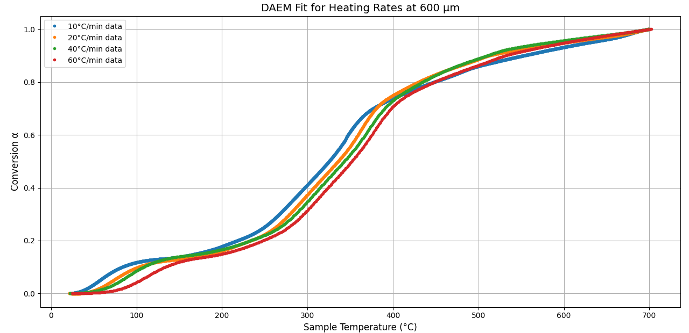
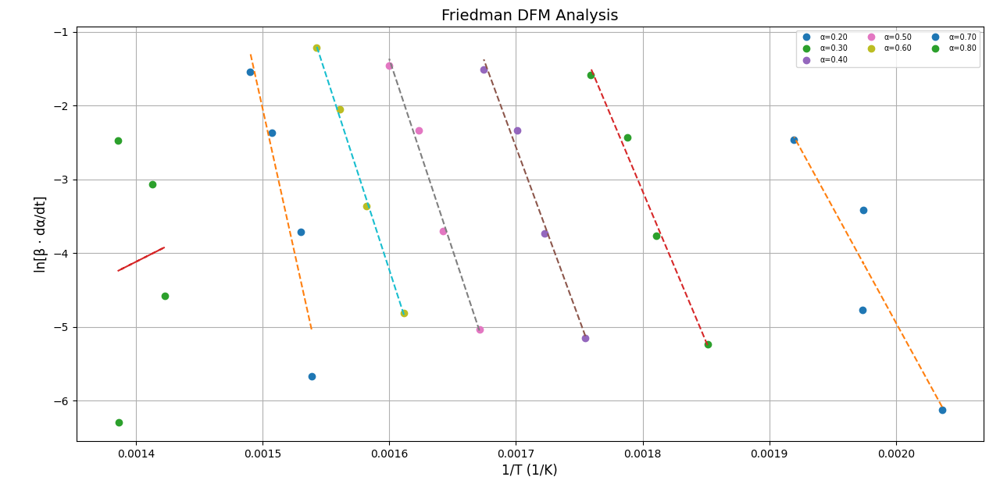
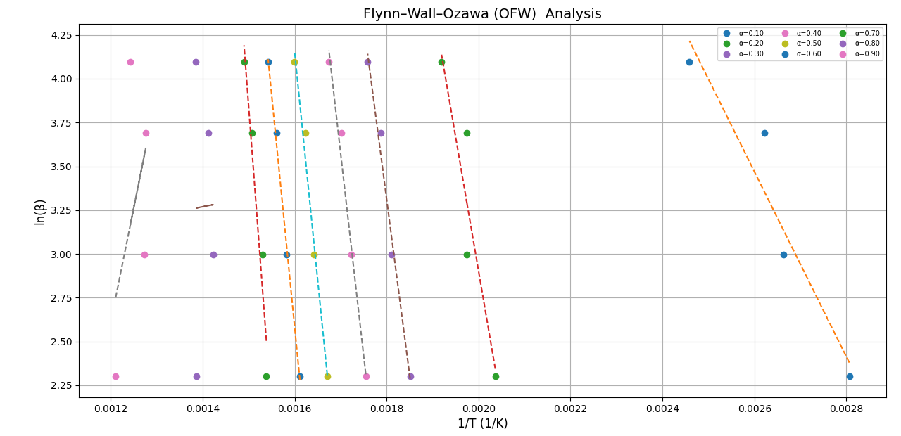
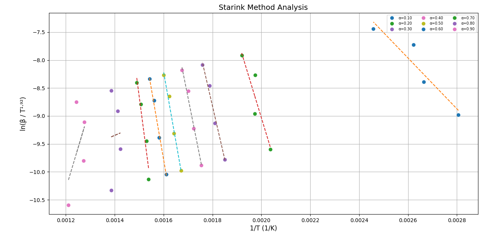

# Kinectic Modelling

## Overview 📝

This project provides an **automated workflow for TGA kinetics analysis**.  
It reads raw TXT-format TGA data, computes **conversion (α)**, **temperature at α (Tα)**, **reaction rate (dα/dt)**, and applies multiple **iso-conversional methods** to calculate:

- **Activation Energy (Ea, kJ/mol)**
- **Pre-exponential factor (A, 1/s)**
- **Regression quality (R²)**

**Key Highlights:**
- 🚀 Fast interpolator-based calculations.
- 🔄 Supports multiple heating rates simultaneously.
- 📈 Generates plots and summary tables automatically.
- 🗃️ Outputs CSVs for all raw and processed data.

---


##  Methods Used 📊

| Model                                 | Y-function            | Ea Formula                              |
|---------------------------------------|-----------------------|-----------------------------------------|
| Distributed Activation Energy Model   | ln(β / T²)            | Ea = -slope × R / 1000                  |
|  Friedman                             | ln(β·dα/dt)           | Ea = -slope × R / 1000                  |
| Kissinger-Akahira-Sunose              | ln(β / T²)            | Ea = -slope × R / 1000                  |
|  Ozawa-Flynn-Wall                     | ln(β)                 | Ea = -slope × R / 1.0516 / 1000         |
| Starink                               | ln(β / T¹·⁹²)         | Ea = -slope × R / 1.0008 / 1000         |

---

## Folder Structure 📁

```
minor_project/
│
├─ analysis/
│ ├─ deam_analysis.py  
│ ├─ dataLoader.py   # Loads txt files
│ └─ dpm_analysis.py  
│ └─ kas_analysis.py 
│ └─ ofw_analysis.py  
│ └─ sparink_analysis.py  
│
├─ dataSets/ # Input TGA TXT files
│ ├─ wallnut@5 (600 micron).txt
│ ├─ wallnut@10 (600 micron).txt
│ ├─ wallnut@40 (600 micron).txt
│ └─ wallnut@60 (600 micron).txt
│
├─ images / # Shows all for plots
│ ├─ deam.png
│ ├─ dfm.png
│ ├─ kas.png
│ ├─ ofw.png
│ ├─ starink.png
|
├─ results / # Display all for csv_files
│ ├─ daem_results.csv
│ ├─ dfm_results.csv
│ ├─ kas_results.csv
│ ├─ ofw_results.csv
│ ├─ starink_results.csv
│
├─ kinetic_analysis.py # Main executable script
```

---

## 📷 Screen Shots

### Distributed Activation Energy Model


### Friedman


### Kissinger-Akahira-Sunose


### Ozawa-Flynn-Wall


###  Starink


---

⭐ **If you like this project, give it a star on GitHub!**
