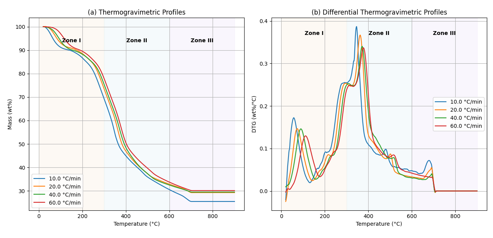
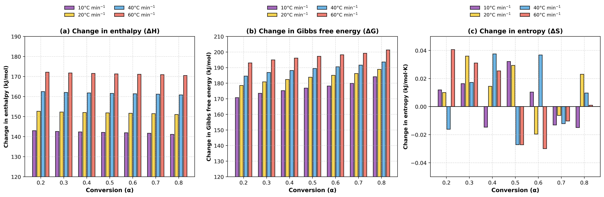
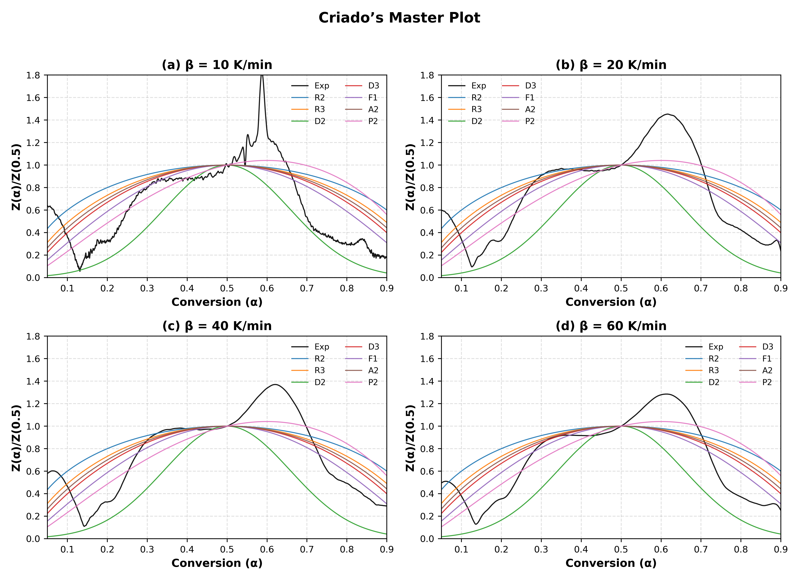

# Kinectic Modelling

## Overview 📝

This project provides an **automated workflow for TGA kinetics analysis**.  
It reads raw TXT-format TGA data, computes **conversion (α)**, **temperature at α (Tα)**, **reaction rate (dα/dt)**, and applies multiple **iso-conversional methods** to calculate:

- **Activation Energy (Ea, kJ/mol)**
- **Pre-exponential factor (A, 1/s)**
- **Regression quality (R²)**

**Key Highlights:**
- 🚀 Fast interpolator-based calculations.
- 🔄 Supports multiple heating rates simultaneously.
- 📈 Generates plots and summary tables automatically.
- 🗃️ Outputs CSVs for all raw and processed data.

---

##  Methods Used 📊

| Model                                 | Y-function            | Ea Formula                              |
|---------------------------------------|-----------------------|-----------------------------------------|
| Distributed Activation Energy Model   | ln(β / T²)            | Ea = -slope × R / 1000                  |
|  Friedman                             | ln(β·dα/dt)           | Ea = -slope × R / 1000                  |
| Kissinger-Akahira-Sunose              | ln(β / T²)            | Ea = -slope × R / 1000                  |
|  Ozawa-Flynn-Wall                     | ln(β)                 | Ea = -slope × R / 1.0516 / 1000         |
| Starink                               | ln(β / T¹·⁹²)         | Ea = -slope × R / 1.0008 / 1000         |

---

## 📷 Screen Shots

### Distributed Activation Energy Model

### Friedman

### Kissinger-Akahira-Sunose

### Ozawa-Flynn-Wall

###  Starink

### Thermogravimetric Profiles

### Thermodynamic Energy

###  Criado Master Plot

---

# 🔬 Criado’s Master Plot (DFM-Based)

This module generates **Criado’s Master Plots** for the *non-isothermal pyrolysis* of **Peltophorum pterocarpum (PP)** based on the **Differential Method**.  
It helps to identify the most probable **degradation mechanism** by comparing experimental and theoretical master curves.

---

## ⚙️ Purpose

The Criado method normalizes the experimental reaction rate data obtained from thermogravimetric analysis (TGA).  
By plotting the normalized function **Z(α)/Z(0.5)** against the degree of conversion **α**, the resulting curves at different heating rates (β) can reveal whether the degradation follows diffusion, nucleation, or geometrical contraction mechanisms.

---

⭐ **If you like this project, give it a star on GitHub!**
